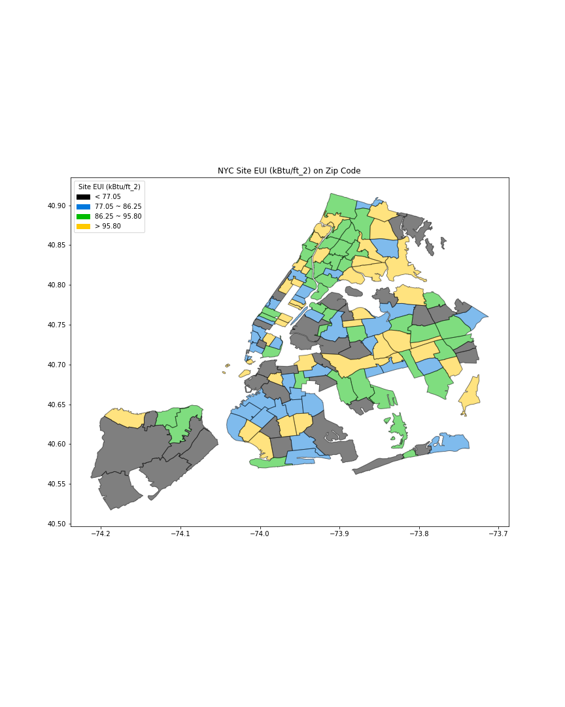

# Homework 8

Plot the Energy usage in NYC with Site EUI based on Zipcode.

### Data source:
2016 Energy and Water Data Disclosure (Data for Calendar Year 2015)
http://www.nyc.gov/html/gbee/downloads/excel/nyc_benchmarking_disclosure_data_reported_in_2016.xlsx

### Plotting:

**Figure 1:** NYC Energy usage (Site EUI (kBtu/ft_2)) for each Zip Codes.
Black shows the areas whose average Site EUI is below 77.05(<25% of the whole).
Blue shows the areas whose average Site EUI is between 77.05 and 86.25 (25% ~ 50% of the whole).
Green shows the areas whose average Site EUI is between 86.25 and 95.80 (50% ~ 75% of the whole).
Yellow shows the areas whose average Site EUI is over 95.80 (>75% of the whole).
Some areas have no color because the data there are outliers and are removed. 
